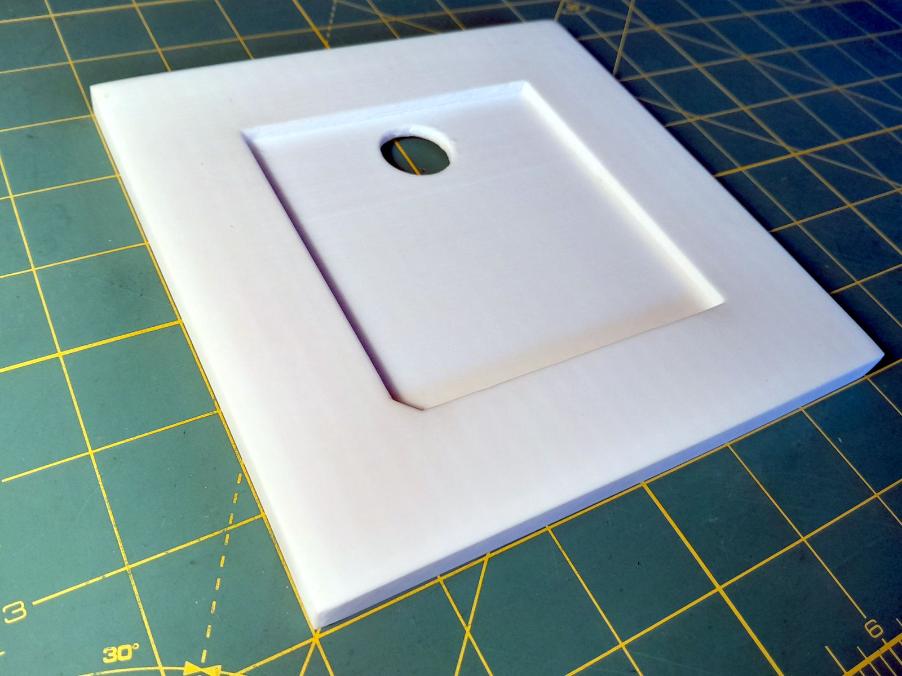

# Floppy Scanning Frame

My scanner cuts off a little bit of the inside edges if you push something into the corner, so when I scan floppies after archiving them, the end result looks crummy.

This is a 3D-printable frame to assist with consistent scans. It has an indentation for a 3½" floppy on one side, and a 5¼" floppy and sleeve on the other. Very fancy.

  
(If you know the first thing about using a 3D printer, I'm sure you can get better results than I have.)

While the 3½" side works great, the outline for the 5¼" sleeve doesn't work so well due to the variations in the size and shape of various sleeves. I've included a version that omits the sleeve cutout (bare disk only), but note that I haven't tested this variant. Should work, though. 

Designed (if you can call it that) in FreeCAD.
